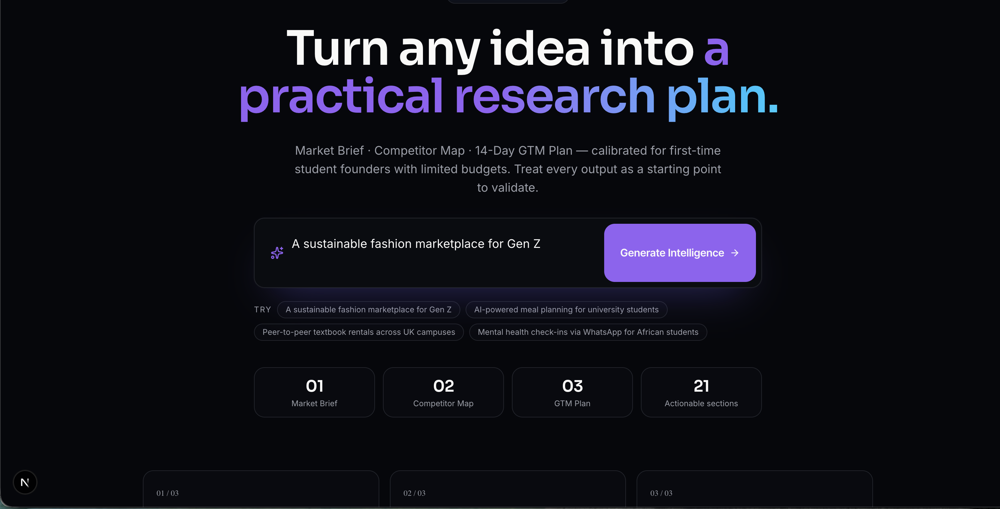
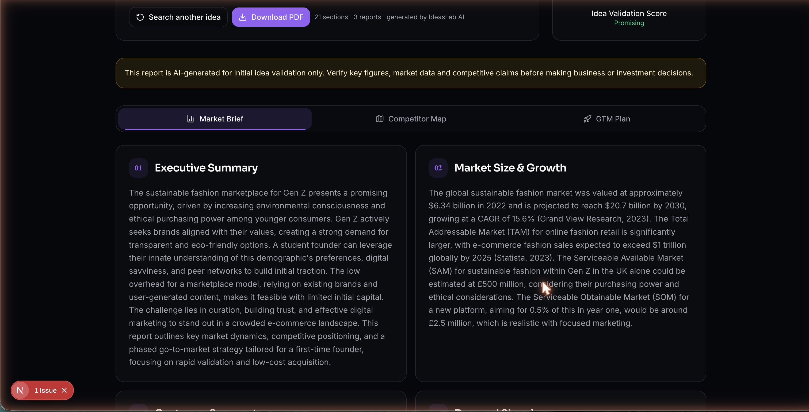
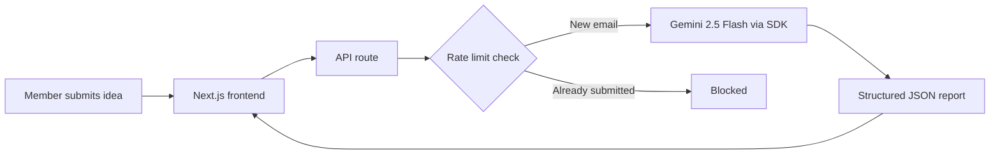

# IdeasLab Market Research Tool

A member submits a business idea and gets back a Market Brief, a Competitor Map, and a 14-day GTM plan, generated by an LLM working from a fixed schema and a citation requirement.

Live tool: [pending co-founder sign-off before public launch]
Demo walkthrough: [can be watched here](https://www.loom.com/share/c69b756c7e5741d4a14bbdf83d549e41)

## The problem

IdeasLab is an entrepreneur community I co-founded. We have 120+ members and an Instagram following approaching 80,000.

Most of those people are sitting on a business idea with no fast way to test it. Real market research takes hours, even when you know how to do it. Most members don't have the hours or the skill set, so the idea either sits in a group chat waiting for feedback or gets built with no validation at all.

I wanted a first-pass check members could run the moment they had an idea, something faster than commissioning real research and more useful than guessing.

## What it does

A member fills in a short form describing their idea. The tool sends it to Gemini and returns three reports: a Market Brief, a Competitor Map, and a 14-day GTM plan, 21 sections in total. Each submission also gets a validation score and a visible disclaimer that the output is a starting point, not verified research.

## Architecture

I built the frontend and API routes in Next.js. The API calls Gemini 2.5 Flash through the @google/generative-ai SDK. The app is hosted on Vercel.

There's no database beyond what rate limiting needs. No queue. No background job. A submission is one request and one response.

## Key decisions

Wiring a Next.js app to an LLM API is the easy part. The decisions below are where the actual work happened, and where I'd want a hiring manager or a future collaborator to look.

### Gemini 2.5 Flash over Claude Sonnet

I built the first working version on Claude Sonnet. The reports read well. They also cost roughly £0.52 per submission.

That's a manageable number for a handful of test runs. Against an audience approaching 80,000, where a single launch post could plausibly drive a large volume of submissions, it isn't.

I moved to Gemini 2.5 Flash. The decision was driven by cost and by Gemini's published benchmark performance against comparable models. I hadn't run my own side-by-side quality test at that point.

I want to be straight about that gap. I haven't yet done a rigorous quality comparison between the two models on this specific report format. That work is still open. I've shared the tool with my co-founders so they can sense-check outputs against what we'd expect from a real market brief, and I'm treating that as active, ongoing validation.

What I did have before switching was a cost projection. I worked out what Claude Sonnet would cost at the submission volumes a launch to 80,000 followers could realistically produce, and decided the margin didn't hold for a free tool at that scale. That's the tradeoff I made and own: I chose cost certainty over a quality bar I was still in the middle of confirming.

### Structured output over freeform generation

Early versions let the model write freeform text. It read fine as a single block of prose, then broke the moment I tried to build a UI around it. Section headers drifted between runs. A competitor analysis would sometimes show up folded inside market sizing instead of on its own.

I moved to native JSON mode with an enforced response schema. Every report now returns the same fields in the same shape on every run.

A chat product can afford to be freeform. The conversation is the interface. A report product can't. A founder reading this needs sections they can point to and compare across submissions, not a paragraph they have to parse to find the part about their target customer.

### Controlling hallucination with citation requirements

The real risk in this tool is a model stating a market size or a competitor's funding round with complete confidence and no basis for the figure.

My mitigation is a system prompt that requires inline source citations. Every claim the model makes needs a named source next to it, Statista, Crunchbase, or a comparable industry source.

Here's the honest limit of that approach. Naming a source doesn't verify it. The model can attach "Statista" to a number Statista never published, and the citation requirement has no way to catch that on its own.

Compared to earlier versions with no grounding instruction, it does seem to cut down on bare, unsourced claims in practice. But it's a mitigation, and it doesn't guarantee accuracy. Anyone using a report to make a real decision should still check the numbers that matter to them.

That's also why every report carries a visible disclaimer: AI-generated for initial idea validation only; verify key figures before making business or investment decisions. The citation requirement is a prompt-level control. The disclaimer is the honest backstop for what a prompt-level control can't guarantee.

### Rate limiting before public launch

Before this goes out to 80,000 followers, I built rate limiting: one report per email address. I'll leave the implementation out of this write-up.

The reasoning is launch risk management. An open tool with no limit, in front of an audience that size, invites repeat submissions and cost exposure I can't forecast in advance.

Most members will never notice this feature exists. Its job is to keep launch day from turning into an expensive surprise.

## Outcome

[This section follows once the live link is up. Add post-launch metrics: submissions in week one, cost per submission at scale, member feedback, anything else worth citing]

## Lessons learned

[First-pass draft below, replace with your own reflections once you've lived with the launch]

The cost decision taught me to model unit economics before I fell in love with a specific model's output quality. £0.52 a submission is invisible in testing and very visible at 80,000 followers.

Structure beats freeform the moment a product has to render output reliably rather than just display it. Next time, I'd build the schema first and write the prompt around it.

The real lesson from the Gemini switch is knowing which gap you're shipping with and saying so.
